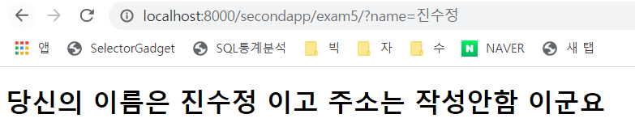

내 컴퓨터의 IP 주소 확인할 때, cmd 창에 **ipconfig** 입력하면  DNS, IP Address,Subnet Mask, Gateway의 주소가 나온다. (기본적인 네트워크 정보 확인) 

우리가 통상적으로 알아보려는 ip주소는 아래표시된 IPv4주소이다.


127.0.0.1 은 이름이 부여되어있음. localhost라고 해도 됨.


http://127.0.0.1:8000/welcom/은 아래와 동일

http://localhost:8000/welcome/  : ---> firstapp.views.welcome을 수행


http://localhost:8000/secondapp : ---> views.exam1 수행

http://localhost:8000/secondapp/exam2/  : ---> views.exam2 수행


**HttpRequest** : HTTP 프로토콜 기반으로 요청이 왔을 때, 요청 관련 정보를 제공하는 객체

(요청처리)		뷰함수가 호출될 때, 아규먼트로 전달된다. (장고서버가 객체를 생성한다.)

**HttpResponse** : HTTP 프로토콜 기반으로 온 요청에 대한 응답시 사용하는 객체 응답 내용을 담게 된다. 

(응답처리)	  	 (HTML 태그 문자열, 템플릿을 사용한 랜더객체)


- 템플릿 변수 : {{변수명}}

  - 뷰에서 템플릿으로 객체를 전달한다.

  - 딕셔너리로 전달해야한다.

- 탬플릿 태그(로직) : 

  - if 문, for문과 같이 흐름을 제어할 수 있다.
  - POST 방식일 경우, url 끝에 반드시 `/`를 붙여야하고, 보안을 위한 토큰이 필요하다.


```html
<form method="POST" action="/secondapp/exam2/">
        
    <input type="hidden" name="info1" value="djangp">
    <input type="hidden" name="info2" value="css">
    <input type="hidden" name="info3" value="javascript">
    <input type="submit" value="<form>태그로 POST방식 요청">
</form>
```

`` : 화면에 영향을 주지 않는다.

페이지 소스 보기를 하면

`<input type="hidden" name="csrfmiddlewaretoken" value="dxVjO3t3DufJxtbp1ZYDRMyTskcGuyUScLbbhJUCvQQPbWzOIMwNAP5Rxru6Hs8a">` 

보안을 위해 사용되는 토큰이다.

이번 요청이 정당한 방법이다 알리는 용도로 추가 됨.


```html
<ul>

    <li>{{ student.name }}</li>

</ul>
```

반복문, 조건문 등을 사용할 때는 종료태그 필요함. (유닉스 같은 느낌)

---

## **<실습>**

http://localhost:8000/workapp/exercise1/


**[ 장고 실습 - 1 ]**

1. 실습용 장고 프로젝트를 한 개 생성한다.

   cmd 창에서 c:\xxx\DJANGOexam 폴더로 옮겨가고 여기에서 exerciseproject 이라는 프로젝트 폴더를 생성한다.

2. exerciseproject을 파이참에서 오픈한다.

3. exerciseproject의 실행 환경을 djangovenv 이라는 가상환경으로 설정한다.

4. workapp 이라는 장고앱을 생성한다.
5. 프로젝트의 `settings.py` 파일의 INSTALLED_APPS에 wrokapp 을 등록한다.(33행)
   LANGUAGE_CODE(**'ko-kr'**) 와 TIME_ZONE(**'Asia/Seoul'**)도 설정한다.(107행)

6. 프로젝트의 urls.py 파일에 workapp1의 urls.py 를 “workapp/”이라는 매핑명으로 등록한다.

(include하라는 겁니다요)

7. workapp1의 다음 기능의 웹 서버 프로그램을 구현한다.

   브라우저에서 http://localhost:8000/workapp/exercise1/이라고 요청하면 

   `<h1> 안녕하세요? XXX가 만든 첫 장고 웹 페이지 입니다.</h1>`         

[ 요구사항 ]

- 구현하는 뷰의 함수명은 exercise1() 이다.

- 브라우저에서 요청할 때 사용하는 URL에 작성할 이 뷰에 대한 매핑명은  “exercise1/” 이다.

  (이 때 매핑 정보를 등록하는 urls.py 는 workapp 에 있는 urls.py 이다.)

- 응답 역할의 템플릿은 exercise1.html 으로 한다

- XXX은 본인의 이름 또는 별명이며 뷰에서 템플릿인 HTML에 전달한다.


301 : URL 끝에 / (슬래시) 안붙이면 다시 요청시킴. (결과는 나오지만, 내부적으로 통신이 한번 더 일어나게됨.)

200 : 성공


URL 뒤에 / (슬래시)를 붙이지 않고 요청하면 301응답과 함께 / 를 붙여 다시 요청하게 됨 (총 2회 통신)

path 설정할 때는 /를 꼭 붙여야한다.

효율적인 통신을 위해 URL 문자열 뒤에 / 꼭 붙여줄 것!

POST 방식에서는 /를 안붙이면 에러 발생


http://localhost:8000/secondapp/exam2_1/

---------------------------------------------------------------URL 문자열

​                                     ---------------------------------URI <즉,  포트번호 다음부터> (쿼리 문자열 포함)

HttpRequest.GET # GET 파라미터를 담고 있는 딕셔너리 같은 객체

HttpRequest.POST # POST 파라미터를 담고 있는 딕셔너리 같은 객체

`msg = request.GET.get("info1", "없음") + "-" + request.GET.get("info2", "없음") + "-" + request.GET.get("info3", "없음")`


**request.GET**은 전달 받은 것들을 모두 딕셔너리 형태로 가져오는 것

**get()** 메서드는 키값이 딕셔너리 안에 있으면 밸류값을 리턴해준다. 키값이 존재하지 않으면 디폴트값 None을 리턴한다.

**request.GET.get()** 은 위 두 개념을 합친 것으로 GET요청이 접근할 수 있는 키와 밸류값을 이용한다. 이것은 장고 뷰스에서 대부분 쓰여진다.

**request.GET.get()** 은 괄호안에 key를 입력하면 value를 가져와주는 것

출처 : https://yulme.tistory.com/56


(1) get()은 python 메소드. 대상은 사전형 데이터

(2) django의 request는 사전형이 아니다.

(3) request를 사전형으로 바꿀 수 있는 것이 request.GET

(4) 에러가 발생하지 않기 때문에 request.GET.get을 사용하는 것이 일반적이다.


출처: https://engineer-mole.tistory.com/125 [매일 꾸준히, 더 깊이]


# [Query 문자열]

HTTP client 가 HTTP Server 요청시 서버에서 요청하려는 대상의 URI가 전달되는데 

이때 함께 전달될 수 있는 문자열이다.

- name = value 형식으로 구성되어야 한다.

- 여러 개의 name = value 가 사용될 때는 &  기호로 구분되게 구성해야 한다.

- 영문과 숫자는 그대로 전달되지만, 한글과 특수문자들은 % 기호와 16진수 코드값으로 전달된다. (UTF-8)

- 공백문자는 + 기호 또는 %20로 전달 된다.

- Query 문자열을 가지고 HTTP Server에게 정보를 요청할 때는

  두 가지 요청 방식 중 한 개를 선택할 수 있다. 

  **GET** : Query 문자열이 외부에 보여진다. 요청 URL 뒤에 ?기호와 함께 전달되기 때문이다. Query 문자열의 길이 제한 있음.

  **POST** : Query 문자열이 외부에 보여지지 않는다. Query 문자열의 길이에 제한이 없다.


https://search.naver.com/search.naver?where=nexearch&sm=top_hty&fbm=1&ie=utf8&query=ABCabc+123+%EA%B0%80%EB%82%98%EB%8B%A4

한글 3바이트 씀. %EA%B0%80 : 가  %EB%82%98 : 나  %EB%8B%A4 : 다


## get 방식/ POST 방식

**중요**

**post** : 쿼리 문자열이 외부로 보여지면 안될 때 내부로만 전달되게끔함. (주소필드를 나타내지 않음.) 반드시 폼 태그 써야함. 쿼리를 가지고 요청함.

특히, 로그인 정보 등등

**get** : 보여줘도 상관 없을 때  주소 필드에 나타남. , a태그는 get 방식 , 쿼리 문자열 없이 요청


http://localhost:8000/secondapp/exam5/

get 방식


http://localhost:8000/secondapp/exam5/?name=%EC%A7%84%EC%88%98%EC%A0%95



```html
<a href="http://localhost:8000/secondapp/exam2_1/?info1=aa&info2=BB&info3=CC"></a>
```

검색할 내용을 붙여서 응답할 수 있다.


<exam6를 활용한 실습2>

http://localhost:8000/secondapp/exam6/

http://localhost:8000/workapp/exercise2/