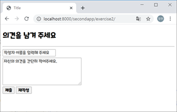
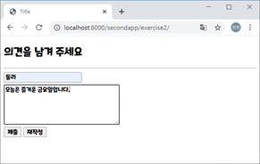
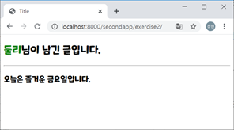
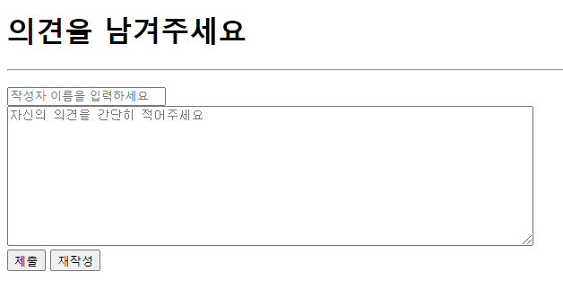
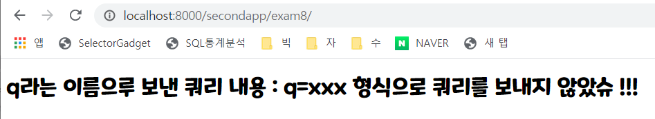
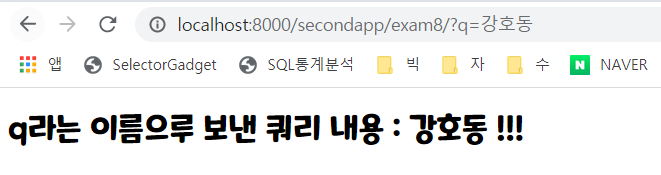
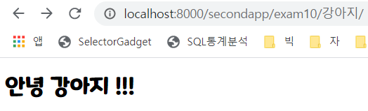
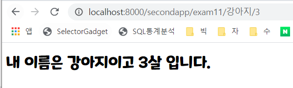
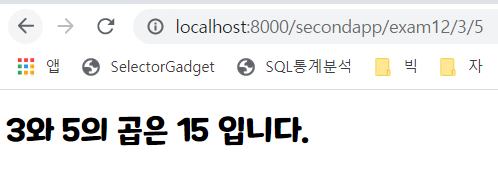

## <exam6를 활용한 실습2>

http://localhost:8000/secondapp/exam6/

http://localhost:8000/workapp/exercise2/

[ 장고 실습 - 2 ]

(1) 브라우저에서 http://localhost:8000/workapp/exercise2/ 로 요청하면 다음과 같이 입력 화면이 출력된다.



(2) 작성자 이름과 의견을 다음과 같이 입력하고 제출버튼을 클릭하면



(3) 다음의 결과 화면이 출력되도록 장고 서버 프로그램을 구현한다.



[ 요구 사항 ]

- 1개의 뷰함수(views.py)와 1개의 템플릿으로 완성한다. 

  (뷰함수명: exercise2(), 템플릿 파일명 : exercise2.html)

- GET 방식 요청시 위의 입력 폼 화면이 출력((1)번 화면)되고 POST 방식 요청시 Query 문자열로 전달되는 작성자명과 의견 정보를 추출하여 (3)번 화면과 같이 브라우저에 출력한다.



exerciseproject\urls.py

```python
from django.contrib import admin
from django.urls import path, include

urlpatterns = [
    path('admin/', admin.site.urls),
    path('workapp/', include('workapp.urls')),
]
```

workapp\urls.py

```python
from django.urls import path
from . import views
urlpatterns = [
    path('exercise1/', views.exercise1, name='exercise1'),
    path('exercise2/', views.exercise2, name='exercise2'),
]
```

views.py

```python
from django.shortcuts import render
from django.http import HttpResponse
from django.template import loader

def exercise1(request):
    template = loader.get_template('exercise1.html')
    name = "진수정"
    context = {'result': name}
    return HttpResponse(template.render(context, request))

def exercise2(request) :
    if request.method == 'POST':
        na = request.POST['name']
        op = request.POST['opinion']
        context = {'na': na, 'op': op}
    else :
         context = None  # 탬플릿에 전달할 게 없으므로 None 전달
    return render(request, 'exercise2.html', context)
```

exercise1.html

```python
<!DOCTYPE html>
<html lang="en">
<head>
    <meta charset="UTF-8">
    <title>Title</title>
</head>
<body>
<h1>안녕하세요? {{result}}이 만든 첫 장고 웹 페이지 입니다.</h1>
</body>
</html>
```

**{{변수명}}**

exercise2.html

```html
<!DOCTYPE html>
<html lang="en">
<head>
    <meta charset="UTF-8">
    <title>Title</title>
</head>
<body>
<p>
     <!-- na과 op이라고 보관 되어 있는 Value가 있는가?-->
        <h2><span style="color : green"> {{na}}</span>님이 남긴 글입니다.</h2>
        <hr>
        <h3> {{op}}</h3>
    
        <form method="POST" action="/workapp/exercise2/">  <!-- form태그화면이 브라우저에 출력 -->
            <h1>의견을 남겨주세요</h1>
            <hr>
            
            <input type="text" name="name" placeholder="작성자 이름을 입력해 주세요" required><br>
            <textarea name="opinion" rows="10" cols="80" placeholder="자신의 의견을 간단히 적어 주세요"></textarea><br>
            <input type="submit" value="제출">
            <input type="reset" value="재작성">
        </form>
    
</p>
</body>
</html>
```

if 문 쓰면 `` 반드시 써줘야함.

http://localhost:8000/workapp/exercise2/ 으로 요청하면 get 방식

submit : `<form method="POST" action="/workapp/exercise2/">` post방식으로 action이 취해진다. (보안적으로 요청됨.)

post 방식일 때, action에 / 안붙이면 에러나고, `` 안써도 에러남.


파이참에서 에러난 부분에 `alt + enter` 누르면 해결방법알려줌


http://localhost:8000/secondapp/exam7/

studyproject의 서브폴더 studyproject에 templates 폴더 (base.html, basesimple.html 들어있음) 복사하기

studyproject의 settings.py에서 55행쯤에

```python
ROOT_URLCONF = 'studyproject.urls'
import os
TEMPLATES = [
    {
        'BACKEND': 'django.template.backends.django.DjangoTemplates',
        'DIRS': [os.path.join(BASE_DIR, 'studyproject', 'templates')],
        'APP_DIRS': True,
        'OPTIONS': {
            'context_processors': [
                'django.template.context_processors.debug',
                'django.template.context_processors.request',
                'django.contrib.auth.context_processors.auth',
                'django.contrib.messages.context_processors.messages',
            ],
        },
    },
]
```

`import os` 추가 하고,  `'DIRS': [os.path.join(BASE_DIR, 'studyproject', 'templates')],` 추가하기


```html



  <h1>오늘의 저녁 메뉴</h1>
  <h2>{{ pick }} 입니다.</h2>

```


http://localhost:8000/secondapp/exam8/

views.py

```python
def exam8(request) :
    query = 'q' in request.GET
    if query :
        result = request.GET['q']
    else:
        result = 'q=xxx 형식으로 쿼리를 보내지 않았슈'
    context = {
        'result': result,
    }
    return render(request, 'exam8.html', context)
```

exam8.html

```html



    <h1>q라는 이름으루 보낸 쿼리 내용 :  {{ result }} !!!</h1>

```

 (쿼리 문자열 주지 않은 경우)

http://localhost:8000/secondapp/exam8/ 로 요청하면 



(쿼리 문자열 준 경우)

http://localhost:8000/secondapp/exam8/?q=%EA%B0%95%ED%98%B8%EB%8F%99 요청하면 




http://localhost:8000/secondapp/exam9/

웹폰트 사용

views.py

```python
def exam9(request):
    context = None
    foodstr = ""
    if request.method == 'POST':
        foods = request.POST.getlist("food", "없음")  # 다중 선택 이기 때문.. multiple select 일 때도 getlist
        for f in foods :
            foodstr += f+" "
        fcolor = request.POST.get("fcolor", "없음")
        year = request.POST.get("year", "없음")
        memo = request.POST.get("memo", "없음")
        birth = request.POST.get("birth", "없음")
        context = {
            'info': {  # 또다른 딕셔너리(파이썬 객체)를 주고 있음.
                'info1' : foodstr,
                'info2': fcolor,
                'info3': year,
                'info4': memo,
                'info5': birth,
            }
        }
    return render(request, 'exam9.html', context)
```


```html
% extends 'basesimple.html' %}


    
        <h1>작성된 정보는 다음과 같습니다.</h1><hr>
        <h3>좋아하는 음식 : {{ info.info1 }}</h3>
        <h3>좋아하는 칼라 : {{ info.info2 }}</h3>
        <h3>태어난 년도 : {{ info.info3 }}</h3>
        <h3>메모 : {{ info.info4 }}</h3>
        <h3>생일 : {{ info.info5 }}</h3>
    
        <h1>정보를 작성하세요.</h1><hr>
        <form method="post" action="http://localhost:8000/secondapp/exam9/">    <!-- 같은 서버일 경우,/secondapp/exam9/만 줘도 됨-->
            
            좋아하는 음식 : <br>
            <input type="checkbox" name="food" value="불고기">불고기  <!-- type="checkbox" 원하는만큼 선택 가능-->
            <input type="checkbox" name="food" value="치킨">치킨
            <input type="checkbox" name="food" value="피자" checked>피자  <!-- checked는 기본 선택-->
            <input type="checkbox" name="food" value="짜장면">짜장면<br><br>
            좋아하는 칼라 : <br>
            <input type="radio" name="fcolor" value="노란색">노란색
            <input type="radio" name="fcolor" value="녹색" checked>녹색
            <input type="radio" name="fcolor" value="주황색">주황색<br><br>
            태어난 년도 : <br>
            <select name="year">
                <option value="2000">2000</option>
                <option value="2001">2001</option>
                <option value="2002">2002</option>
                <option value="2003">2003</option>
                <option value="2004">2004</option>
            </select><br><br>
            남기려는 글 : <br>
            <textarea name="memo" rows="5" cols="50"></textarea><br><br>
            생일 : <br>
            <input type="date" name="birth"><br><br>
            <input type="submit" value="전송">
            <input type="reset" value="재작성">
        </form>
    

```


http://localhost:8000/secondapp/exam10/

404에러남. 

views.py

```python
def exam10(request, name):
    context = {
        'name': name,
    }
    return render(request, 'exam10.html', context)
```

매개변수가 하나 늘었음.  URL 뒤에 path정보로  반드시 무언가 줘야함. 

urls.py

```python
path('exam10/<name>/', views.exam10, name='exam10'),
```

`<name>` 은 작성한 문자열을 매개변수로 전달한다는 뜻. 

exam10.html

```html



    <h1>안녕 {{ name }} !!!</h1>

```




http://localhost:8000/secondapp/exam11/%EA%B0%95%EC%95%84%EC%A7%80/3

urls.py

```python
path('exam11/<name>/<int:age>', views.exam11, name='exam11'),
```

 URL 뒤에 path정보로  반드시 무언가 줘야함. 

반드시 <>안에 변수명을 지정해주고, `<age>` 타입을 지정했기 때문에 정수형이어야만 오류 안뜸.

views.py

```python
def exam11(request, name, age):
    context = {
        'name': name,
        'age': age,
    }
    return render(request, 'exam11.html', context)
```

exam11.html

```html



    <h1>내 이름은 {{ name }}이고 {{ age }}살 입니다.</h1>

```




http://localhost:8000/secondapp/exam12/3/5

urls.py

```python
path('exam12/<int:num1>/<int:num2>', views.exam12, name='exam12'),
```

views.py

```python
def exam12(request, num1, num2):
    result = num1 * num2
    context = {
        'num1': num1,
        'num2': num2,
        'result': result,
    }
    return render(request, 'exam12.html', context)
```

exam12.html

```html



    <h1>{{ num1 }}와 {{ num2 }}의 곱은 {{ result }} 입니다.</h1>

```





https://docs.djangoproject.com/ko/3.1/


https://www.w3schools.com/bootstrap4/bootstrap_buttons.asp 버튼 종류


https://data.seoul.go.kr/index.do